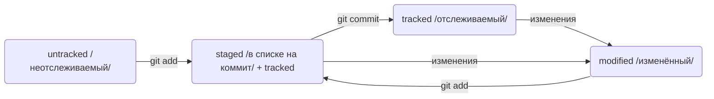

# information
## описание
**information - на данном этапе файл содержит команды для git**
*******************************************************************

## hash
- Сокращенный журнал вызывается с помощью команды **git log --oneline** command
----------------------------------------------------------------------

## git status

### пояснение:
1. Файл только что создали. Git ещё не отслеживает его содержимое. Состояние: *untracked*
2. Файл добавили в staging area с помощью **git add .** Состояние: *staged (+ tracked)*
- Возможно, изменили файл ещё раз. Состояния: *staged, modified (+ tracked)*
Обратите внимание: *staged и modified* у одного файла, но у разных его версий.
- Ещё раз выполнили **git add .** Состояние: *staged (+ tracked)*
3. Сделали коммит с помощью **git commit.** Состояние: *tracked*
4. Изменили файл. Состояние: *modified (+ tracked)*
5. Снова добавили в staging area с помощью **git add .** Состояния: *staged (+ tracked)*
6. Сделали коммит. Состояния: *tracked*
7. Повторили пункты 4−7 много раз.
----------------------------------------------------------------------
### какие состояния показывает команда **git status** :
- staged (Changes to be committed в выводе git status);
- modified (Changes not staged for commit);
- untracked (Untracked files).